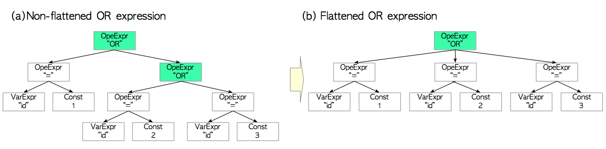
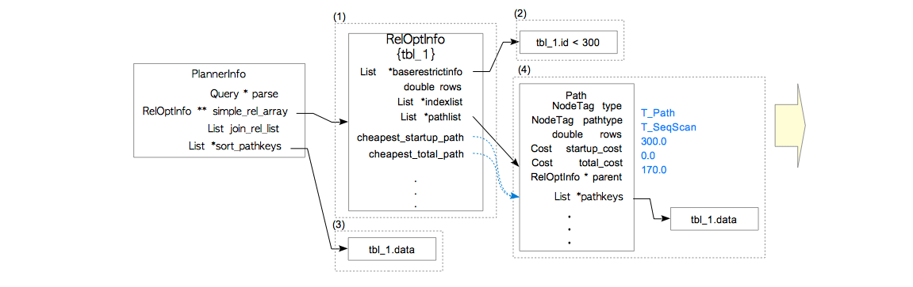
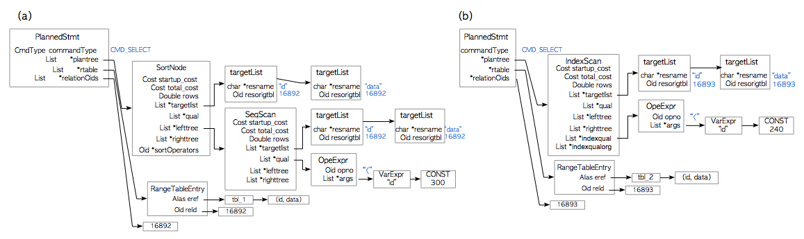

[返回 - pg 查询在计划器所做的事 00182](./pg_planner.md) 


# 计划树 - 单表查询的计划树

## 分析的目标

我们分析计划树中比较简单的 单表查询计划树。

## 计划器行的三个步骤

1. 执行预处理
2. 在所有可能的访问路径中，找出代价最小的访问路径
3. 按照代价最小的路径，创建计划树

## 访问路径

访问路径（access path）是估算代价时的处理单元。

比如顺序扫描，索引扫描，排序以及各种连接操作都有其对应的路径。访问路径只在计划器创建查询计划树的时候使用。最基本的访问路径数据结构是 relation.h 中定义的Path结构体。它就相当于是顺序扫描。所有其他的访问路径都基于该结构.

计划器为了处理三个步骤，会在内部创建一个PlannerInfo数据结构。在该数据结构中包含着查询树、查询所涉及关系信息、访问路径等等。

```
typedef struct PathKey {
    NodeTag type;
    EquivalenceClass *pk_eclass; /* 值是否有序 */
    Oid pk_opfamily;             /* 用于定义顺序的B树操作符族 */
    int pk_strategy;             /* 排序方向(ASC or DESC) */
    bool pk_nulls_first;         /* NULL是否排序在常规值之前？ */
} PathKey;

typedef struct Path {
    NodeTag type;
    NodeTag pathtype;          /* 标识 scan/join 方法的标签 */
    RelOptInfo *parent;        /* 路径所基于的关系 */
    PathTarget *pathtarget;    /* Vars/Exprs的列表, 代价, 宽度 */
    ParamPathInfo *param_info; /* 参数化信息, 如果没有则为NULL */
    bool parallel_aware;       /* 涉及到并行相关的逻辑？ */
    bool parallel_safe;        /* 是否能作为并行执行计划的一部分? */
    int parallel_workers;      /* 期待的并行工作进程数量； 0表示没有并行 */

    /* 估计路径的尺寸或代价 (更多详情参考costsize.c) */
    double rows;       /* 预估结果元组数目 */
    Cost startup_cost; /* 获取任何元组前需要花费的代价 */
    Cost total_cost;   /* 总代价 (假设获取所有元组所需代价) */
    List *pathkeys;    /* 路径输出的排序顺序 */
    /* pathkeys 是PathKey节点的列表，PathKey定义见上面 */
} Path;

typedef struct PlannerInfo {
    NodeTag type;
    Query *parse;                    /* 被计划的查询 */
    PlannerGlobal *glob;             /* 当前计划器运行时的全局信息 */
    Index query_level;               /* 最外层查询为1 */
    struct PlannerInfo *parent_root; /* 最外层查询为NULL */

    /* plan_params包含着当前计划中的查询层次需要对低层查询暴露的表达式。
     * outer_params包含着PARAM_EXEC参数中的paramId列表，这些参数是外
     * 部查询层次对当前查询层次所暴露的。*/
    List *plan_params; /* PlannerParamItems的列表, 见下 */
    Bitmapset *outer_params;

    /* simple_rel_array 持有着指向“基础关系”与“其他关系”的指针 (详情参考
     * RelOptInfo的注释)。它由rangetable index所索引（因此第0项总是废值）。
     * 当RTE并不与基础关系相对应，譬如连接的RTE，或未引用的视图RTE，或该
     * RelOptInfo还没有产生时，里面的项目可能为NULL。*/
    struct RelOptInfo **simple_rel_array; /* 所有单个关系的RelOptInfos */
    int simple_rel_array_size;            /* 数组分配的大小 */

    /* simple_rte_array 与simple_rel_array 长度相同，且持有指向关联范围表项的指针。
     * 这使得我们能避免执行rt_fetch(), 当需要展开很大的继承集时会很慢。 */
    RangeTblEntry **simple_rte_array; /* rangetable的数组 */

    /* all_baserels是所有查询所涉及基本关系的关系ID列表（但不含“其他关系”的ID）
     * 也就是说，最终连接时，所需构建的关系标识符。该字段是由make_one_rel计算的。
     * 计算发生于计算Paths之前。*/
    Relids all_baserels;

    /* nullable_baserels 是在进行外连接的jointree中那些可空的基础关系的ID集合。
     * 这些关系可能在WHERE子句，SELECT目标列表或其他地方产生空值。该字段由函数
     * deconstruct_jointree负责计算。*/
    Relids nullable_baserels;

    /* join_rel_list是一个列表，在计划过程中连接关系的RelOptInfos都放在这里。
     * 对于比较小的问题，我们只是简单的扫过这个列表来完成查找。但当连接很多关系时，
     * 我们会使用散列表来加速查询。散列表当且仅当join_rel_hash不为空时存在且
     * 有效。注意即使用散列表查找时，我们依然会维护列表，这会简化GEQO的相关问题。*/
    List *join_rel_list;        /* 连接关系的RelOptInfos */
    struct HTAB *join_rel_hash; /* 连接关系的散列表，可选 */

    /* 当使用动态规划进行连接搜索时，join_rel_level[k]是第k层的连接关系RelOptInfos列表。
     * 新的连接关系RelOptInfos会自动添加到join_rel_level[join_cur_level]中，
     * 而join_cur_level为当前层级。如果没用到动态规划，join_rel_level则为空。*/
    List **join_rel_level;    /* 连接关系RelOptInfo的列表 */
    int join_cur_level;       /* 待追加列表的序号 */
    List *init_plans;         /* 查询的初始SubPlans */
    List *cte_plan_ids;       /* 子计划的ID列表，每个CTE对应一个 */
    List *multiexpr_params;   /* MULTIEXPR子查询输出用到的双层嵌套参数列表 */
    List *eq_classes;         /* 活跃的EquivalenceClasses列表 */
    List *canon_pathkeys;     /* "标准" PathKeys 的列表 */
    List *left_join_clauses;  /* RestrictInfos列表，用于左连接子句 */
    List *right_join_clauses; /* RestrictInfos列表，用于右连接子句 */
    List *full_join_clauses;  /* RestrictInfos列表，用于完全连接子句 */
    List *join_info_list;     /* SpecialJoinInfos 的列表 */
    List *append_rel_list;    /* AppendRelInfos 的列表 */
    List *rowMarks;           /* PlanRowMarks 的列表 */
    List *placeholder_list;   /* PlaceHolderInfos 的列表 */
    List *fkey_list;          /* ForeignKeyOptInfos 的列表 */
    List *query_pathkeys;     /* query_planner()期望的pathkeys */
    List *group_pathkeys;     /* groupClause的pathkeys, 如果有的话 */
    List *window_pathkeys;    /* 底部窗口的pathkeys, 如果有的话 */
    List *distinct_pathkeys;  /* distinctClause的pathkeys, 如果有的话 */
    List *sort_pathkeys;      /* sortClause的pathkeys, 如果有的话 */
    List *initial_rels;       /* 我们现在正在尝试连接的RelOptInfos */

    /* 使用fetch_upper_rel()来获取任意特定的上层关系 */
    List *upper_rels[UPPERREL_FINAL + 1]; /* upper-rel RelOptInfos */

    /* grouping_planner针对上层处理过程选择的目标列表 */
    struct PathTarget *upper_targets[UPPERREL_FINAL + 1];

    /* grouping_planner会将最终处理过后的targetlist回传至此。在最终计划最顶层的目标列表中会用到 */
    List *processed_tlist;

    /* create_plan()期间填充的字段，定义于setrefs.c */
    AttrNumber *grouping_map;    /* 针对GroupingFunc的修补 */
    List *minmax_aggs;           /* MinMaxAggInfos列表 */
    MemoryContext planner_cxt;   /* 持有PlannerInfo的上下文 */
    double total_table_pages;    /* 查询涉及到所有表的页面总数 */
    double tuple_fraction;       /* 传递给查询计划器的tuple_fraction */
    double limit_tuples;         /* 传递给查询计划器的limit_tuples */
    bool hasInheritedTarget;     /* 若parse->resultRelation为继承的子关系则为真 */
    bool hasJoinRTEs;            /* 如果任意RTEs为RTE_JOIN类别则为真 */
    bool hasLateralRTEs;         /* 如果任意RTEs被标记为LATERAL则为真 */
    bool hasDeletedRTEs;         /* 如果任意RTEs从连接树中被删除则为真 */
    bool hasHavingQual;          /* 如果havingQual非空则为真 */
    bool hasPseudoConstantQuals; /* 如果任意RestrictInfo包含
                                    pseudoconstant = true则为真 */
    bool hasRecursion;           /* 如果计划中包含递归WITH项则为真 */

    /* 当hasRecursion为真时，会使用以下字段： */
    int wt_param_id;                 /* 工作表上PARAM_EXEC的ID */
    struct Path *non_recursive_path; /* 非递归项的路径 */

    /* 这些字段是createplan.c的工作变量 */
    Relids curOuterRels;  /* 当前节点外部的关系 */
    List *curOuterParams; /* 尚未赋值的NestLoopParams */

    /* 可选的join_search_hook私有数据, 例如, GEQO */
    void *join_search_private;
} PlannerInfo;

```
我们通过具体的例子，来说明怎么创建一个基于单表查询的计划树。

## 预处理操作
在创建计划树之前，计划器对先 PlannerInfo 中的查询树进行一些预处理。

### 预处理的几个主要步骤

1. 简化目标列表（target list），LIMIT子句等；

例如，表达式2+2会被重写为4，这是由 clauses.c 中 eval_const_expressions() 函数负责的。

2. 布尔表达式的规范化

例如，NOT(NOT a)会被重写为a。

3. 压平与、或表达式

SQL标准中的AND/OR是二元操作符，但在PostgreSQL内部它们是多元操作符。而计划器总是会假设所有的嵌套AND/OR都应当被压平。

压平：



## 找出代价最小的访问路径

计划器对所有可能的访问路径进行代价估计，然后找出代价最小的访问路径。

包括以下几个步骤：

1. 创建一个RelOptInfo数据结构，存储访问路径及其代价。

RelOptInfo 结构体是通过 make_one_rel() 函数创建的，并存储在 PlannerInfo 结构体的 simple_rel_array 字段中。

在初始状态时 RelOptInfo 持有着 baserestrictinfo 变量，如果存在相应索引，还会持有 indexlist 变量。baserestrictinfo 存储着查询的 WHERE 子句，而 indexlist 存储着目标表上相关的索引。

```
typedef enum RelOptKind
{
    RELOPT_BASEREL,
    RELOPT_JOINREL,
    RELOPT_OTHER_MEMBER_REL,
    RELOPT_UPPER_REL,
    RELOPT_DEADREL
} RelOptKind;

typedef struct RelOptInfo
{
    NodeTag        type;
    RelOptKind    reloptkind;

    /* 本RelOptInfo包含的所有关系 */
    Relids        relids;            /* 基本关系的ID集合 (范围表索引) */

    /* 由计划器生成的预估尺寸 */
    double        rows;            /* 预估结果元组数目 */

    /* 计划器标记位，每个关系一份 */
    bool        consider_startup;        /* 保留启动代价最低的路径？ */
    bool        consider_param_startup; /* 同上, 针对参数化路径？ */
    bool        consider_parallel;        /* 考虑并行路径？ */

    /* 扫描当前关系的默认结果目标列表 */
    struct PathTarget *reltarget;        /* Vars/Exprs, 代价, 宽度的列表 */

    /* 物化相关信息 */
    List       *pathlist;                /* Path 结构体列表 */
    List       *ppilist;                /* pathlist中使用的ParamPathInfos */
    List       *partial_pathlist;        /* 部分路径 */
    struct Path *cheapest_startup_path;
    struct Path *cheapest_total_path;
    struct Path *cheapest_unique_path;
    List        *cheapest_parameterized_paths;

    /* 基础关系与连接关系都需要的 参数化信息 */
    /* (参见 lateral_vars 与 lateral_referencers) */
    Relids        direct_lateral_relids;    /* 直接以LATERAL方式引用的关系 */
    Relids        lateral_relids;         

    /* 关于基础关系的信息 (连接关系不会设置这些字段！) */
    Index        relid;
    Oid            reltablespace;        /* 表空间 */
    RTEKind        rtekind;            /* RELATION, SUBQUERY, 或 FUNCTION */
    AttrNumber    min_attr;            /* 关系属性的最小值 (通常<0) */
    AttrNumber    max_attr;            /* 关系属性的最大值 */
    Relids           *attr_needed;        /* 被索引的数组 [min_attr .. max_attr] */
    int32           *attr_widths;           /* 被索引的数组 [min_attr .. max_attr] */
    List           *lateral_vars;           /* 关系所引用的LATERAL Vars 与 PHVs */
    Relids        lateral_referencers;/* 侧面引用本表的关系 */
    List           *indexlist;            /* IndexOptInfo列表 */
    BlockNumber pages;                /* 来自pg_class的页面数估计值 */
    double        tuples;
    double        allvisfrac;
    PlannerInfo *subroot;            /* 如有子查询 */
    List           *subplan_params;     /* 如有子查询 */
    int            rel_parallel_workers;    /* 期望的并行工作进程数量 */

    /* 有关外部表与外部表连接的相关信息 */
    Oid            serverid;        /* 外部表与外部表连接相应的服务器ID */
    Oid            userid;            /* 用于检查访问权限的用户标识 */
    bool        useridiscurrent;/* 当前用户是否能合法进行JOIN */
    struct FdwRoutine *fdwroutine;
    void           *fdw_private;

    /* 被各种扫描与连接所使用 */
    List           *baserestrictinfo;    /* RestrictInfo结构体列表 (如果存在基础关系) */
    QualCost    baserestrictcost;    /* 求值上述限制条件的代价 */
    List           *joininfo;            /* RestrictInfo 结构体列表，涉及到本表的连接会用到 */
    bool        has_eclass_joins;    /* T 意味着joininfo不完整 */
} RelOptInfo;
```

2. 估计所有可能访问路径的代价，并将访问路径添加至 RelOptInfo 结构中。

这一处理过程的细节如下：

- 创建一条路径，估计该路径中顺序扫描的代价，并将其写入路径中。将该路径添加到RelOptInfo 结构的 pathlist 变量中。
- 如果目标表上存在相关的索引，则为每个索引创建相应的索引访问路径。估计所有索引扫描的代价，并将代价写入相应路径中。然后将索引访问路径添加到 pathlist 变量中。
- 如果可以进行位图扫描，则创建一条位图扫描访问路径。估计所有的位图扫描的代价，并将代价写入到路径中。然后将位图扫描路径添加到 pathlist 变量中。
- 从 RelOptInfo 的 pathlist 中，找出代价最小的访问路径。

3. 如有必要，估计LIMIT，ORDER BY和AGGREGATE操作的代价。

为了更加清晰的理解计划器的执行过程，下面给出具体的例子。

### 例子
研究一个简单单表查询，该查询同时包含 WHERE 和 ORDER BY 子句。
```
testdb=# \d tbl_1
     Table "public.tbl_1"
 Column |  Type   | Modifiers 
--------+---------+-----------
 id     | integer | 
 data   | integer | 

testdb=# SELECT * FROM tbl_1 WHERE id < 300 ORDER BY data;
```
本例中计划器的处理过程：



1. 创建一个 RelOptInfo 结构，将其保存在 PlannerInfo 结构的 simple_rel_array 字段中。

2. 在 RelOptInfo 结构的 baserestrictinfo 字段中，添加一条 WHERE 子句。

WHERE子句id<300会经由 initsplan.c 中定义的 `distribute_restrictinfo_to_rels()` 函数，添加至列表变量 baserestrictinfo 中。另外由于目标表上没有相关索引，RelOptInfo 的 indexlist 字段为空。

3. 为了满足排序要求，planner.c中的 `standard_qp_callback()` 函数会在 PlannerInfo 的 sor_pathkeys 字段中添加一个 pathkey。

Pathkey 是表示路径排序顺序的数据结构。本例因为查询包含一条 ORDER BY 子句，且该子句中的列为 data，故 data 会被包装为 pathkey，放入列表变量 `sort_pathkeys` 中。

4. 创建一个Path结构，并使用 `cost_seqscan` 函数估计顺序扫描的代价，并将代价写入`Path`中。然后使用 `pathnode.c` 中定义的 `add_path()` 函数，将该路径添加至 RelOptInfo 中。

如之前所提到过的，Path 中同时包含启动代价和总代价，都是由 `cost_seqscan` 函数所估计的。

在本例中，因为目标表上没有索引，计划器只估计了顺序扫描的代价，因此最小代价是自动确定的。

5. 创建一个新的 RelOptInfo 结构，用于处理 ORDER BY 子句。

注意新的 RelOptInfo 没有 baserestrictinfo 字段，该信息已经被WHERE子句所持有。

6. 创建一个排序路径，并添加到新的 RelOptInfo 中；然后让 SortPath 的 subpath 字段指向顺序扫描的路径。
```
typedef struct SortPath
{
    Path    path;
    Path    *subpath;        /* 代表输入来源的子路径 */
} SortPath;
```
SortPath 结构包含两个 Path 结构：path 与 subpath；path 中存储了排序算子本身的相关信息，而 subpath 则指向之前得到的代价最小的路径。

注意顺序扫描路径中 parent 字段，该字段指向之前的 RelOptInfo 结构体（也就是在 baserestrictinfo 中存储着 WHERE 子句的那个 RelOptInfo）。因此在下一步创建计划树的过程中，尽管新的 RelOptInfo 结构并未包含 baserestrictinfo，但计划器可以创建一个包含 Filter 的顺序扫描节点，将 WHERE 子句作为过滤条件。

这里已经获得了代价最小的访问路径，然后就可以基于此生成一颗计划树。

## 按照代价最小的路径，创建计划树

计划器按照代价最小的路径生成一颗计划树。 

计划树的根节点是定义在 plannodes.h 中的 PlannedStmt 结构，其中有4个代表性字段：

**commandType**存储操作的类型，诸如SELECT，UPDATE和INSERT。

**rtable**存储范围表的列表（RangeTblEntry的列表）。

**relationOids**存储与查询相关表的oid。

**plantree**存储着一颗由计划节点组成的计划树，每个计划节点对应着一种特定操作，诸如顺序扫描，排序和索引扫描。

```
/* ----------------
 *        PlannedStmt 节点
 * 计划器的输出是一颗计划树，PlannedStmt是计划树的根节点。
 * PlannedStmt存储着执行器所需的“一次性”信息。
 * ----------------*/
typedef struct PlannedStmt
{
    NodeTag        type;
    CmdType        commandType;        /* 增|删|改|查 */
    uint32        queryId;            /* 查询标识符 (复制自Query) */
    bool        hasReturning;        /* 增|删|改是否带有RETURNING? */
    bool        hasModifyingCTE;    /* WITH子句中是否出现了增|删|改？ */
    bool        canSetTag;            /* 我是否设置了命令结果标记？ */
    bool        transientPlan;        /* 当TransactionXmin变化时重新进行计划? */
    bool        dependsOnRole;        /* 执行计划是否特定于当前的角色？ */
    bool        parallelModeNeeded;    /* 需要并行模式才能执行？ */
    struct Plan *planTree;            /* 计划节点树 */
    List           *rtable;            /* RangeTblEntry节点的列表 */
    
    /* 目标关系上用于增|删|改的范围表索引 */
    List           *resultRelations;   /* RT索引的整数列表, 或NIL */
    Node           *utilityStmt;        /* 如为DECLARE CURSOR则非空 */
    List           *subplans;            /* SubPlan表达式的计划树 expressions */
    Bitmapset      *rewindPlanIDs;        /* 需要REWIND的子计划的索引序号 */
    List           *rowMarks;            /* PlanRowMark列表 */
    List           *relationOids;        /* 计划所依赖的关系OID列表 */
    List           *invalItems;        /* 其他依赖，诸如PlanInvalItems */
    int            nParamExec;            /* 使用的PARAM_EXEC参数数量 */
} PlannedStmt;
```

 如上所述，计划树包含各式各样的计划节点。
 
 PlanNode 是所有计划节点的基类，其他计划节点都会包含 PlanNode 结构。比如顺序扫描节点 SeqScanNode，包含一个 PlanNode 和一个整型变量 scanrelid。PlanNode 包含14个字段。下面是7个代表性字段：

`startup_cost`和`total_cost`是该节点对应操作的预估代价。
`rows`是计划器预计扫描的行数。
`targetlist`保存了该查询树中目标项的列表。
`qual`储存了限定条件的列表。
`lefttree`和`righttree`用于添加子节点。

```
/* ----------------
 * 计划节点(Plan Node)
 *
 * 所有的计划节点都"派生"自Plan结构，将其作为自己的第一个字段。这样确保了当其强制转换为Plan
 * 结构时所有东西都能正常工作。(当作为通用参数传入执行器时，节点指针会很频繁地转换为Plan*)
 *
 * 我们从来不会真的去实例化任何Plan节点，它只是所有Plan类型节点的公共抽象父类。
 * ----------------
 */
typedef struct Plan
{
    NodeTag        type;
    /* 计划的预估执行开销 ( 详情见 costsize.c )     */
    Cost        startup_cost;    /* 获取第一条元组前的代价 */
    Cost        total_cost;        /* 获取所有元组的代价 */

    /* 计划器对该计划步骤返回结果大小的估计 */
    double        plan_rows;        /* 计划预期产出的行数 */
    int            plan_width;        /* 以字节计的行宽 */

    /* 并行查询所需的信息 */
    bool        parallel_aware; /* 是否涉及到并行逻辑？ */

    /* 所有计划类型的公有结构化数据 */
    int            plan_node_id;    /* 在整个计划树范围内唯一的标识 */
    List           *targetlist;    /* 该节点需要计算的目标列表 */
    List           *qual;            /* 隐式合取化处理的 限制条件 列表 */
    struct Plan *lefttree;        /* 输入的查询树 */
    struct Plan *righttree;
    List           *initPlan;    /* Init Plan 节点 (无关子查询表达式) */
    /* “参数变化驱动”的重扫描 相关的管理信息
     * extParam包含着所有外部PARAM_EXEC参数的参数ID列表，这些参数会影响当前计划节点
     * 及其子节点。这里不包括该节点initPlans时setParam的相关参数，但会包括其extParams
     * 
     * allParam包含了所有extParam的参数ID列表，以及影响当前节点的参数ID。（即，
     * 在initPlans中setParams的参数）。注意这里包含了*所有*会影响本节点的PARAM_EXEC参数
     */
    Bitmapset    *extParam;
    Bitmapset      *allParam;
} Plan;

/* ------------
 * 扫描节点(Scan nodes)
 * ----------- */
typedef unsigned int Index;

typedef struct Scan
{
    Plan        plan;
    Index        scanrelid;        /* relid 是访问范围表的索引 */
} Scan;

/* ----------------
 *    顺序扫描节点
 * ---------------- */
typedef Scan SeqScan;
```

### 例子
在本例中，一个 SortNode 被添加到 PlannedStmt 结构中，而 SortNode 的左子树上则挂载了一个 SeqScanNode。

在SortNode中，左子树 lefttree 指向 SeqScanNode。

在 SeqScanNode 中，qual 保存了 WHERE 子句：'id<300'。

```
typedef struct Sort
{
    Plan        plan;
    int            numCols;            /* 排序键 列的数目 */
    AttrNumber     *sortColIdx;        /* 它们在目标列表中的位置序号 */
    Oid            *sortOperators;        /* 排序所赖运算符的OID  */
    Oid            *collations;        /* collation的OID  */
    bool           *nullsFirst;        /* NULLS FIRST/LAST 方向 */
} Sort;
```
计划树的例子：



[返回 - pg 查询在计划器所做的事 00182](./pg_planner.md) 


