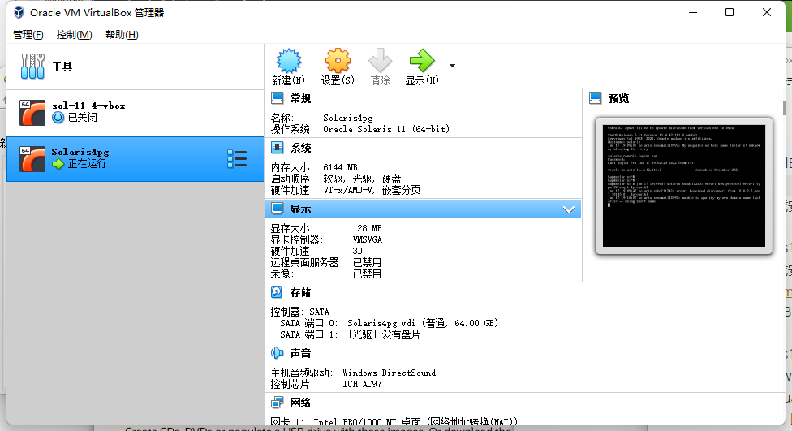

# windows11 下用VirtualBox安装Solaris11.4

1. 安装VirtualBox。

   在官网下载安装即可：https://www.virtualbox.org/wiki/Downloads

2. 下载solaris11.4
   在官网下载安装即可：https://www.oracle.com/jp/solaris/solaris11/downloads/solaris-downloads.html （有很多版本）
   这里选择CBE版本，全都下下来，然后用那个Text的ISO。或者直接下载64位，文本的ISO。

3. 安装solaris11.4
   试过用VMware Workstation安装Solaris，很多莫名的问题。
   试过用VirtualBox安装Solaris11.4的VirtualBox文件（官网会提供），结果是带界面的，并且有很多问题。比如tty窗口黑屏，甚至打不开Terminal。
   
   最后是用VirtualBox新建一个虚拟机，安装文本版本的x86架构的Solaris11.4。全程选择英语环境，因为中文在命令行经常显示有问题，英文也更方便。时区选自己的。
   
   

